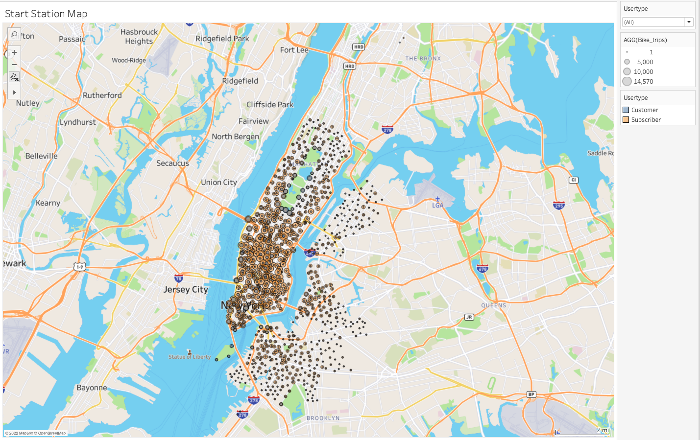
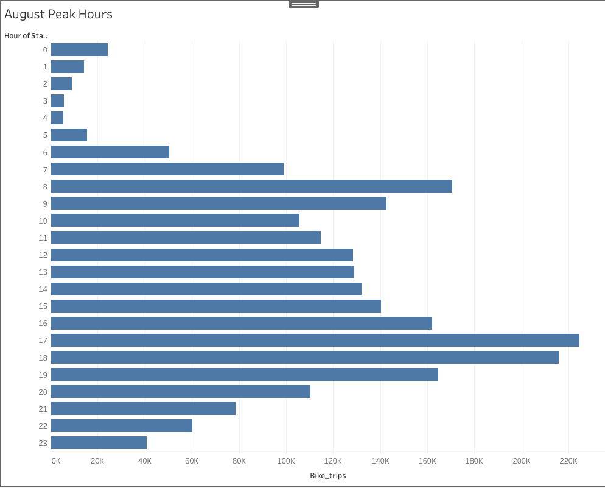
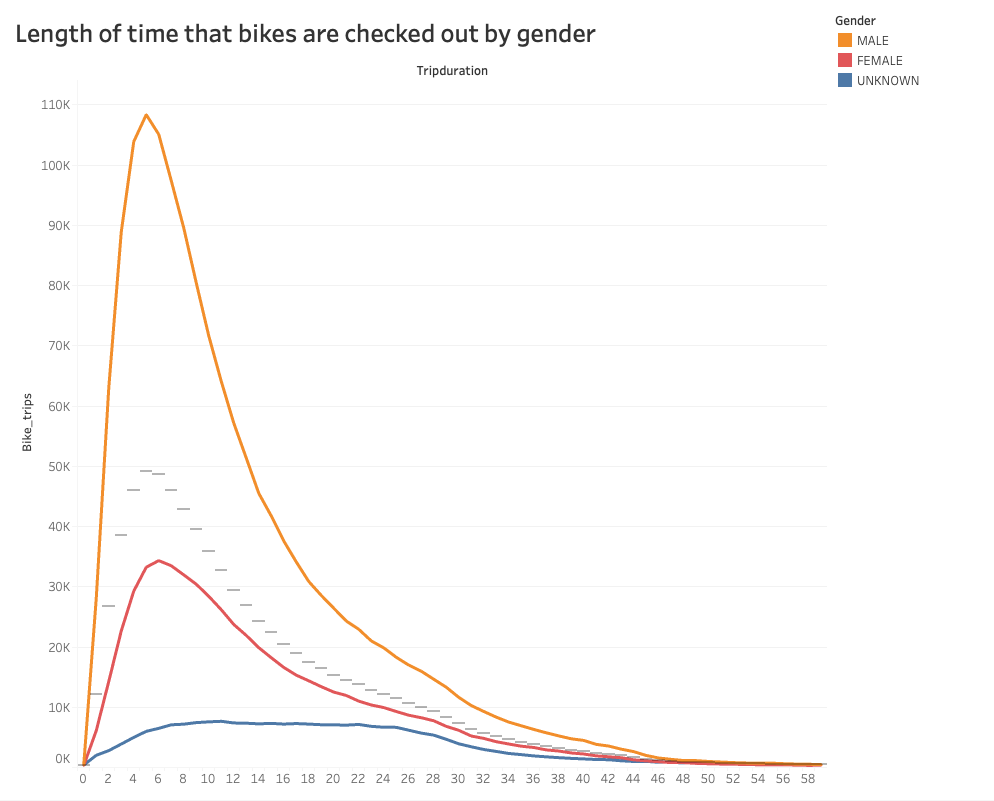
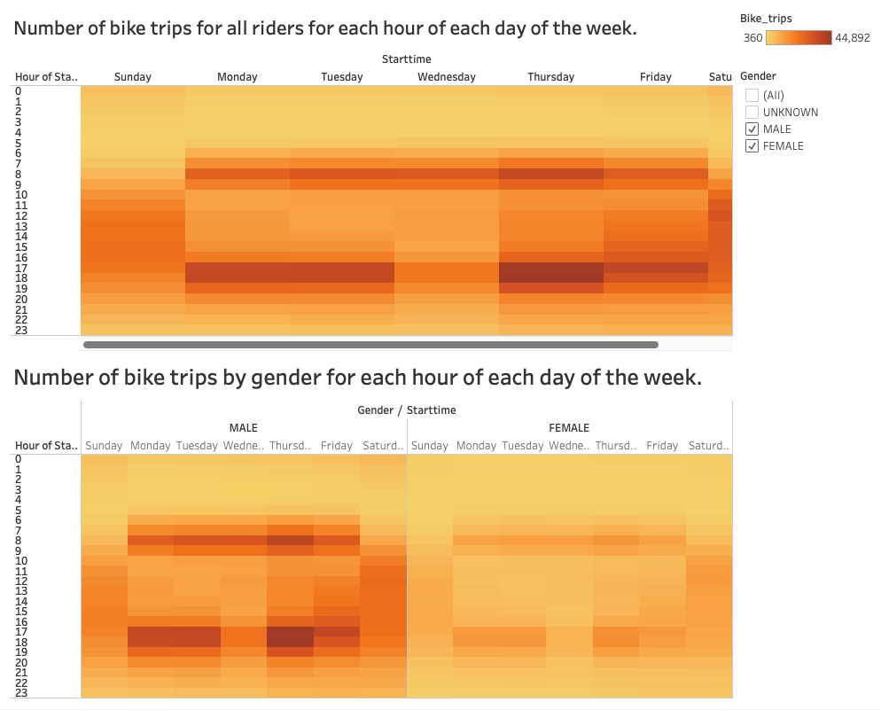
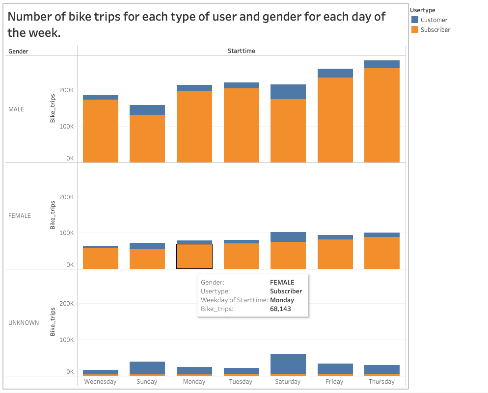

# Bike sharing
[link to dashboard](https://public.tableau.com/app/profile/richard.b.odell.jr/viz/CitiBikeStory_16635601503250/CitibikeStory?publish=yes "link to dashboard")

## Overview of Analysis
The purpose of this analysis is to create a proposal that supports investors to support a bike-sharing program in Des Moines, Iowa. From the given dataset, we were able to create visualizations to see average biking durations trends and the relationships between gender and popular biking times. Specifically, this set of visualizations:

- Show the length of time that bikes are checked out for all riders and genders
- Show the number of bike trips for all riders and genders for each hour of each day of the week
- Show the number of bike trips for each type of user and gender for each day of the week.

## Results
The results of the analysis and visualizations are shown below:

## Summary

Based off of the analysis, we can infer that many of these users may not be tourists but rather work commuters, as most of the peak times are around morning and evening commute. Additionally, a majority of the users were male riders. Although this may not be anything significant, but it's useful for future marketing campaings. Another significant point that can be made is that most of the ride durations peaked at around 5 minutes. If there were to be a bike-sharing program set up in Des Moines, it would help if each station can be set up within 10 minutes of biking distance from each other. This is because we need to take into account that NYC is a large city, where as Des Moines is mainly suburbs. Places tend to be farther apart in suburbs compared to places in large cities.
